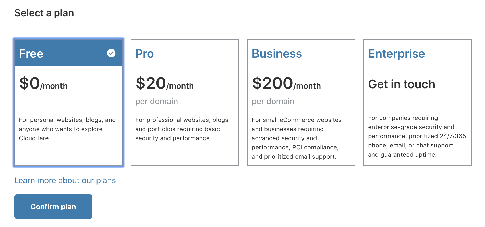
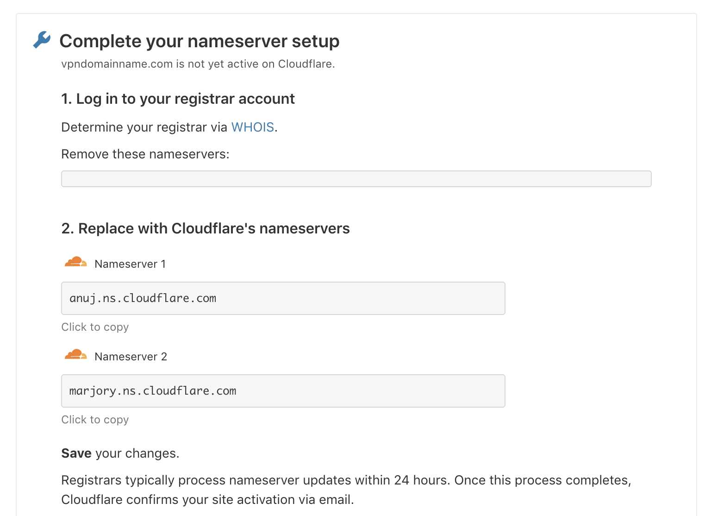
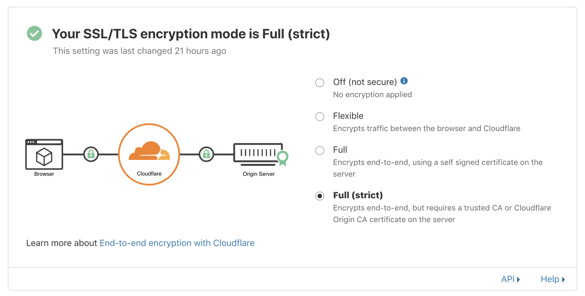

# 2. Use CloudFlare

[Previous](./1.md) | [Next](./3.md)

Now that you have a domain name, you can add a site in [CloudFlare](https://cloudflare.com) to manage your domain name.

Select the Free plan.

You need to copy the 2 nameservers to your domain name registrar so that you can manage your domain name with CloudFlare. Follow the instructions of your registrar on how to change nameservers. They are usually under DNS settings.

Set the SSL mode to "Full (strict)".

> **Why CloudFlare?**
>
> CloudFlare is a company that offers protection against DDOS attacks. They do so by hiding your servers behind their own, and absorbing the attack with their infrastructure. By using their service, it becomes much harder to attack or block your server.

[3. Rent a server](./3.md)