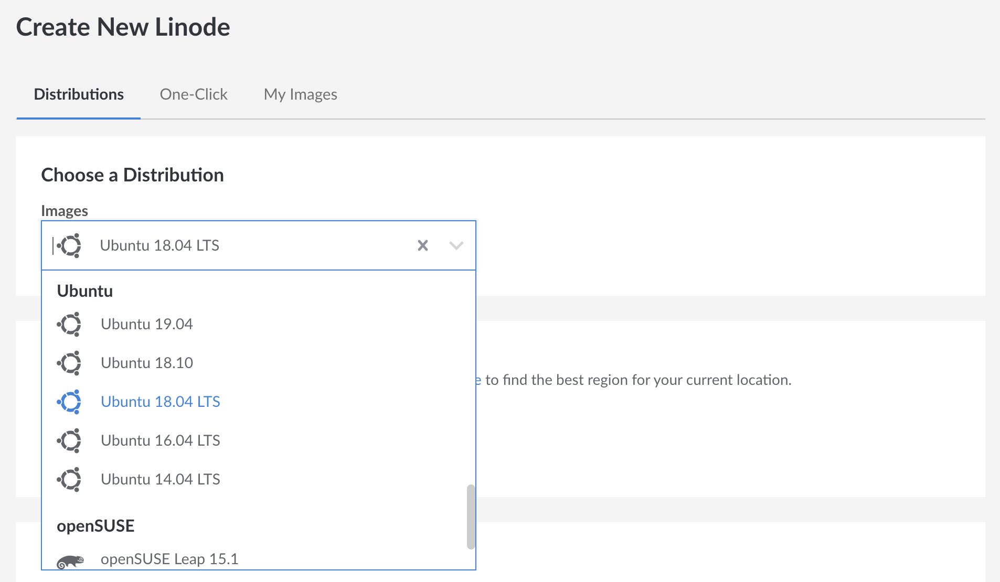
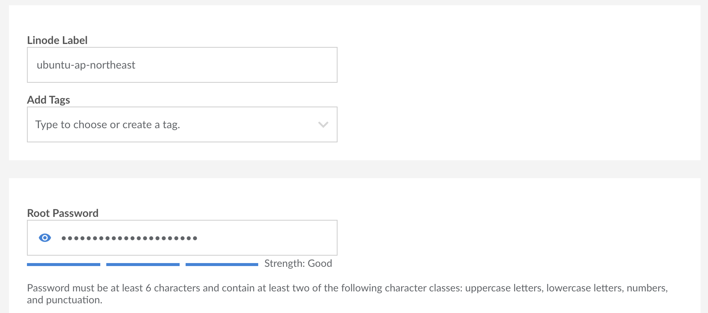
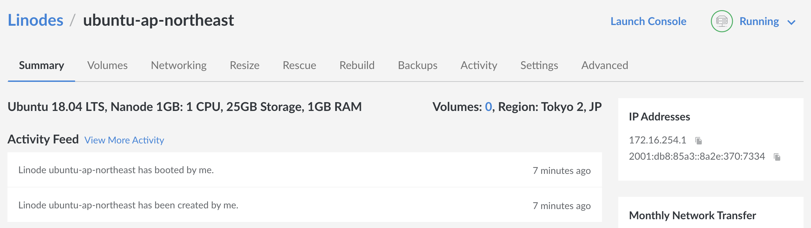
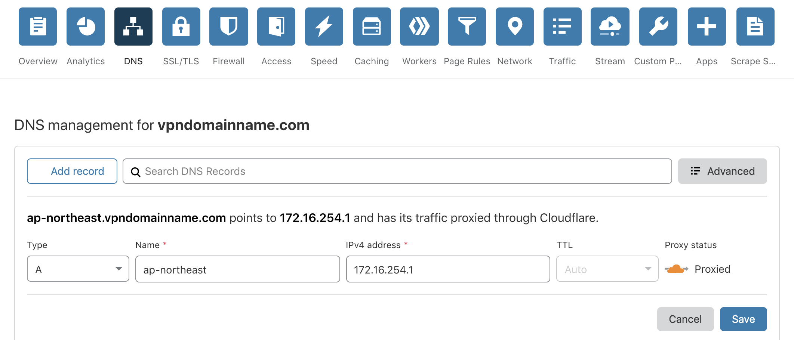

# 3. Rent a server

[Previous](./2.md) | [Next](./4.md)

You need an overseas server to bypass censorship. You can rent a virtual private server (VPS) from [Amazon Web Services](https://aws.amazon.com/ec2/), [DigitalOcean](https://www.digitalocean.com/), [Linode](https://www.linode.com/) and many other providers. We will use Linode in the following guide.

> **What is a virtual private server?**
>
> As opposed to renting a whole physical server, virtual private server is a low cost alternative to having your own server by sharing computing resources like CPU and RAM with other people, while the data is completely separate from one another. You can treat it as a remote computer.

Start by creating a new server.

Select an operating system. Pick the latest Ubuntu with long term support. In this example, select "Ubuntu 18.04 LTS".

Choose a location for your server. The further away it is from you, the more latency it has. Regional restrictions also means that certain content is only available in certain countries. Choose "Tokyo 2, JP" to put your server in Japan.

Choose the capacity of your server. The more powerful it is, the more expensive it is. We can start with the smallest instance for US$5 per month. It can be upgraded later.

Give your server a name (Linode Label) and type in the root password. You need the password to log in to your server later. Leave the rest blank and click "Create".

Give your server some time to boot up. In the meantime, we can set up CloudFlare to point our domain name to our server.

On the right, you can see the IP address of your server. You need to copy this to CloudFlare.

In the "DNS" tab of CloudFlare, add the following record.

**Type**  
Choose "A".

**Name**  
This is the subdomain. This can be anything you want, but use the region name of your server so it will be clear where you are connecting to, if you have more servers in the future. If your server is named "ubuntu-ap-northeast", use "ap-northeast".

**IPv4 address**  
This is the IP address of your server. Paste it here.

**TTL**  
Leave it at "Auto".

**Proxy status**  
Leave the orange cloud on. It should be "Proxied".

[4. Install VPN](./4.md)