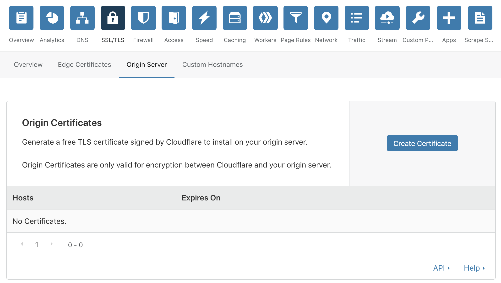
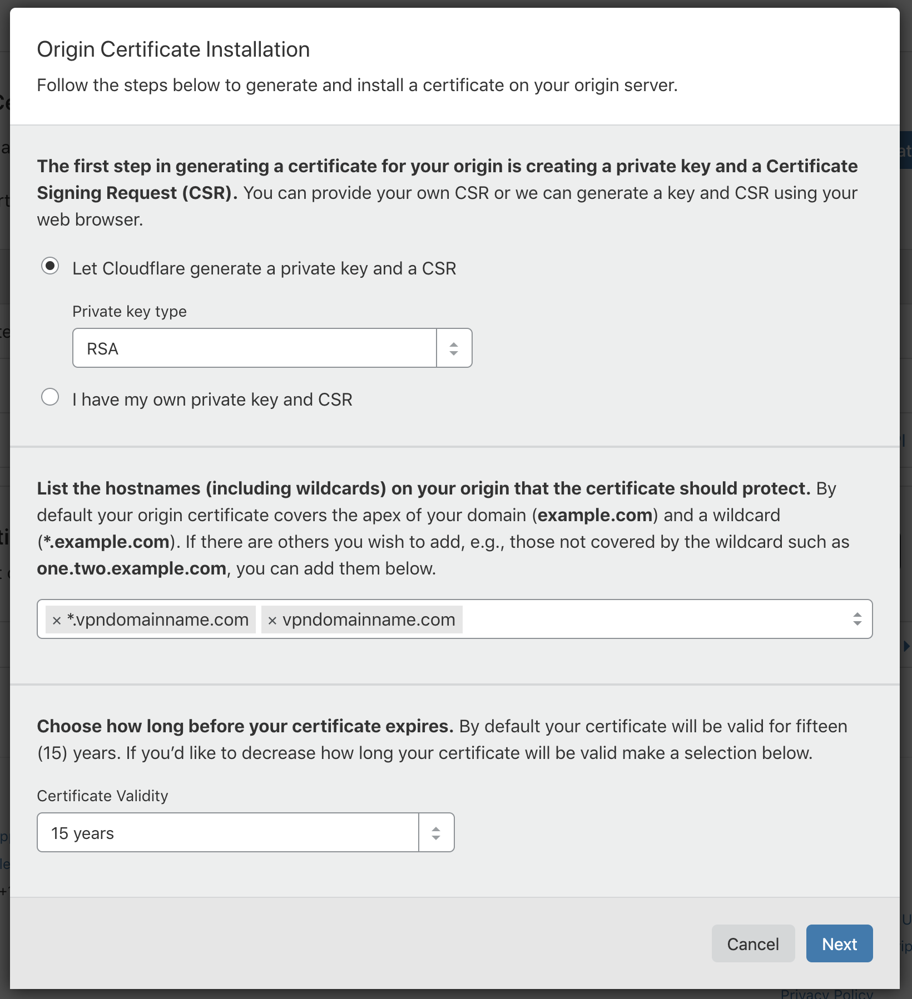
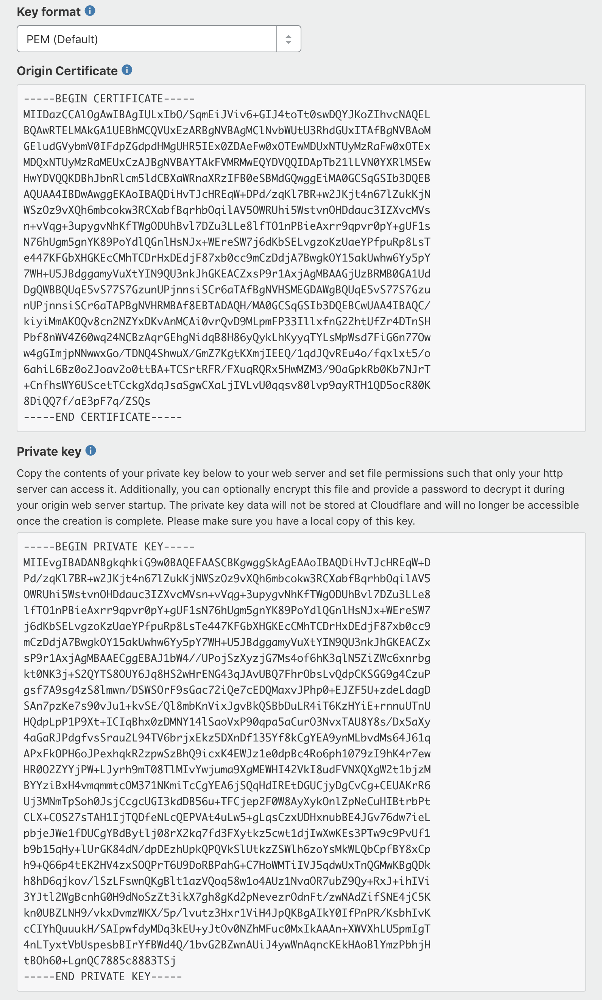

# 4. Install VPN

[Previous](./3.md) | [Next](./5.md)

Your server should have booted up by now. Head to the "Network" tab of Linode or its equivalent in your VPS provider and see how you can log in to your server.


Here you can see

```
ssh root@<your ip address>
```

We are going to log in to your sever with the command line. Open PowerShell on Windows or Terminal on macOS and type that command.

> If you see this message:
>
> The authenticity of host can't be established. Are you sure you want to continue connecting (yes/no)?
>
> Type yes.

### Install nginx

[nginx](https://nginx.org/en/) is a proxy server. We will use it to handle communications to your server.

```
sudo apt update
sudo apt install nginx
```

### Configure nginx

We are about to create a site on the server. We want it to provide you with VPN service whenever you connect to it.

Remember the domain name that you have, and the subdomain that you specified in CloudFlare? We are going to name our configuration file `subdomain.example.com` (use your actual subdomain and domain name, e.g. `ap-northeast.vpndomainname.com`). We will put it inside the configuration folder `/etc/nginx/sites-available/`.

```
sudo nano /etc/nginx/sites-available/subdomain.example.com
```

Now you will be in a text editor. Replace each occurrence of `subdomain.example.com` with your actual subdomain and domain name and each occurance of `example.com` with your actual domain name in the following file and paste it in the editor.

```
server {
    server_name          subdomain.example.com;
    listen               *:80;
    listen               [::]:80;

    return 301 https://subdomain.example.com$request_uri;
}

server {
    listen 443 ssl;
    listen [::]:443 ssl;
    ssl on;
    ssl_certificate       /etc/nginx/ssl/example.com.origin.crt;
    ssl_certificate_key   /etc/nginx/ssl/example.com.origin.key;
    ssl_protocols         TLSv1 TLSv1.1 TLSv1.2;
    ssl_ciphers           HIGH:!aNULL:!MD5;
    server_name           subdomain.example.com;
    location / {
        return 418;
    }
    location /ws/ {
        proxy_redirect off;
        proxy_pass http://127.0.0.1:10086;
        proxy_http_version 1.1;
        proxy_set_header Upgrade $http_upgrade;
        proxy_set_header Connection "upgrade";
        proxy_set_header Host $http_host;
        proxy_set_header X-Real-IP $remote_addr;
        proxy_set_header X-Forwarded-For $proxy_add_x_forwarded_for;
    }
}
```

Hit ctrl+X to close the editor. When it asks "Save modified buffer?", hit Y. It will then ask to confirm the file name to save. Just hit Enter.

To enable the site, we need to link it to the `/etc/nginx/sites-enabled/` folder.

```
sudo ln -s /etc/nginx/sites-available/subdomain.example.com /etc/nginx/sites-enabled/
```

### Install SSL certificate

To encrypt the connection between your server and CloudFlare, we will generate an SSL certificate in CloudFlare and put it in your server.



Head to the "SSL/TLS" tab in CloudFlare, and select "Origin Server" under it. Click "Create Certificate" to generate a new SSL certificate.



There is no need to change anything. Just hit "Next".



Now you will see an "Origin Certificate" and a "Private key". You need to copy both of them to your server.

First make a folder in your server `/etc/nginx/ssl/`.

```
sudo mkdir /etc/nginx/ssl
```

We will save our "Origin Certificate" as `example.com.origin.crt` (replace it with your actual domain name).

```
sudo nano /etc/nginx/ssl/example.com.origin.crt
```

Copy everything in "Origin Certificate" and paste it into the editor. Then hit ctrl+X to close the editor and save it like last time.

Now save the "Private key" as `example.com.origin.key` (replace it with your actual domain name).

```
sudo nano /etc/nginx/ssl/example.com.origin.key
```

Copy everything in "Private key" and paste it into the editor. Then hit ctrl+X to close the editor and save it as usual.

### Restart nginx

Once you restart the proxy server, your site will be up and running.

```
sudo service nginx restart
```

### Install V2Ray

[V2Ray](https://www.v2ray.com/en/) is a VPN tool. We will use it to bypass network restrictions.

```
curl -Ls https://install.direct/go.sh | sudo bash
```

### Configure V2Ray

We need to configure V2Ray to provide you with VPN service when you connect to the site we have created.

First remove the default configuration file.

```
sudo rm /etc/v2ray/config.json
```

Now open the text editor.

```
sudo nano /etc/v2ray/config.json
```

To connect to your VPN, you use a UUID as a password. You can [generate one online](https://www.uuidgenerator.net). Replace the UUID `32645a56-d8c5-455d-bf5d-739a6feba131` in the following file with the one you generated and paste it into the editor.

```json
{
  "inbounds": [
    {
      "port": 10086,
      "listen": "127.0.0.1",
      "protocol": "vmess",
      "settings": {
        "clients": [
          {
            "id": "32645a56-d8c5-455d-bf5d-739a6feba131",
            "alterId": 64
          }
        ]
      },
      "streamSettings": {
        "network": "ws",
        "wsSettings": {
          "path": "/ws/"
        }
      }
    }
  ],
  "outbounds": [
    {
      "protocol": "freedom",
      "settings": {}
    },
    {
      "protocol": "blackhole",
      "settings": {},
      "tag": "blocked"
    }
  ],
  "routing": {
    "rules": [
      {
        "type": "field",
        "ip": [
          "geoip:private"
        ],
        "outboundTag": "blocked"
      }
    ]
  }
}
```

### Restart V2Ray

Restart V2Ray and your VPN server is ready.

```
sudo service v2ray restart
```

[5. Connect to your VPN](./5.md)