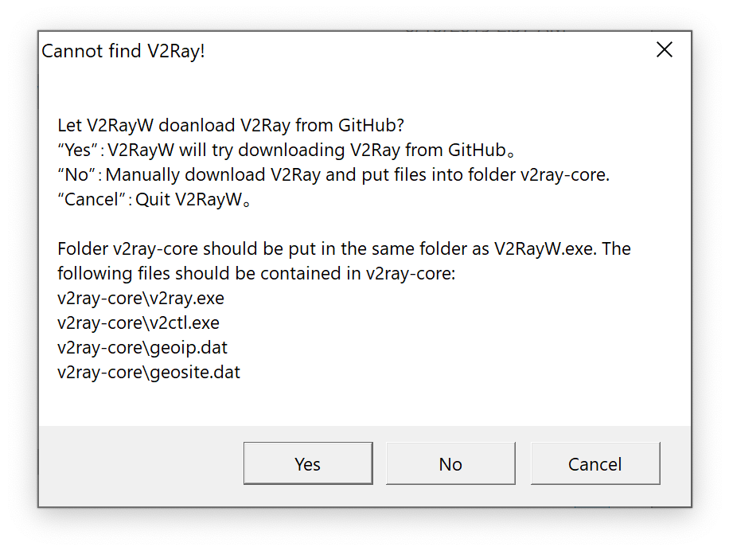
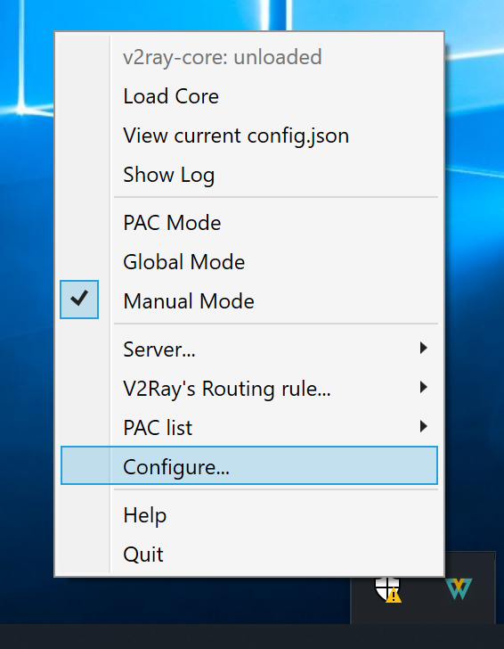
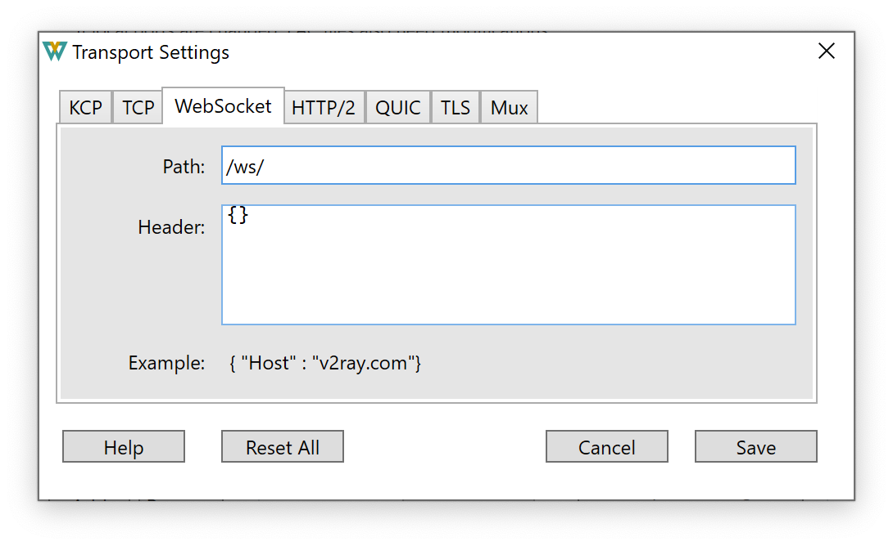
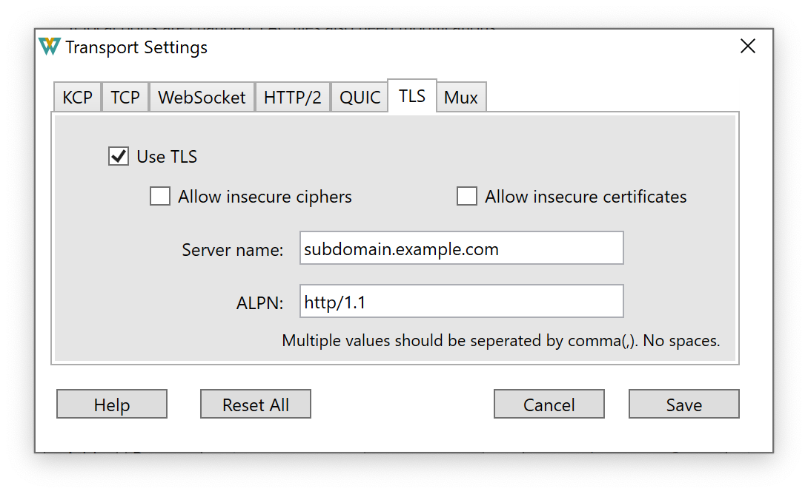
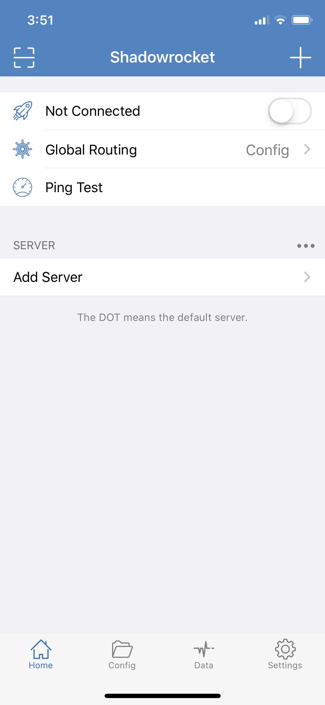
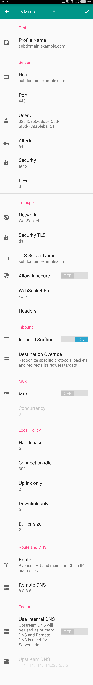

# 5. Connect to your VPN

[Previous](./4.md)

You can start using your VPN. Here are some examples on how you can connect to your VPN in the following platforms.

- [Windows](#windows)
- [macOS](#macos)
- [iOS](#ios)
- [Android](#android)

You can use [other clients](https://www.v2ray.com/en/awesome/tools.html) as well.

### Windows

Go to [V2RayW](https://github.com/Cenmrev/V2RayW/releases) and download V2RayW.zip.


Unzip and run V2RayW.exe.

<p align="center">
  
</p>

A dialog comes up the first time you run it. Click "Yes".

Now right click V2RayW's icon from the task bar to open its menu and click "Configure...".

<p align="center">
  
</p>

Click "Add" to add a server and enter the settings as follows (replace the "Address" and the "Tag" with your subdomain and domain name, and the "User ID" with your UUID):

<p align="center">
  
</p>

Click "Transport settings...". Go to the "WebSocket" tab and enter the path `/ws/`.

<p align="center">
  
</p>

Go to the "TLS" tab and check "Use TLS". Put your subdomain and domain name in the "Server name".

<p align="center">
  
</p>

Save everything. Go back to the menu, select "Global Mode", and then "Load Core". You are now using the VPN. Check your IP address to confirm it is working.

### macOS

Install [V2RayX](https://github.com/Cenmrev/V2RayX) on your Mac. If you are still on your server in Terminal, press ctrl+D to log out of it.

First install [Homebrew](https://brew.sh/). This is a package manager for macOS that help you install various tools. It will take a while.

```
/usr/bin/ruby -e "$(curl -fsSL https://raw.githubusercontent.com/Homebrew/install/master/install)"
```

Install V2RayX.

```
brew cask install v2rayx
```

Run V2RayX.app. When prompted, click "Open".

<p align="center">
  
</p>

A dialog comes up the first time you run it. Click "Install".

<p align="center">
  
</p>

Click V2RayX's icon in the menu bar to open its menu and click "Configure...".

<p align="center">
  
</p>

Click "+" to add a server and enter the settings as follows (replace the "Address" and the "Tag" with your subdomain and domain name, and the "User ID" with your UUID):

<p align="center">
  
</p>

Click "transport settings...". Go to the "WebSocket" tab and enter the path `/ws/`.

<p align="center">
  
</p>

Go to the "TLS" tab and check "Use TLS". Put your subdomain and domain name in the "TLS serverName".

<p align="center">
  
</p>

Save everything. Go back to the menu, select "Global Mode", and then "Load Core". You are now using the VPN. Check your IP address to confirm it is working.

To make it run automatically the next time you restart the Mac, go to "System Preferences" > "Users & Groups" > "Login Items" and add V2RayX to the list.

<p align="center">
  
</p>

### iOS

Install [Shadowrocket](https://apps.apple.com/us/app/shadowrocket/id932747118) (US$2.99).

<p align="center">
  
</p>

Tap "Add Server", and enter the settings as follows (replace the "Host" with your subdomain and domain name, and the "UUID" with your UUID):

<p align="center">
  
</p>

Under "Obfuscation", change the "Name" to websocket and the "Path" to `/ws/`.

<p align="center">
  
</p>

Save the settings and tap the toggle next to "Not Connected". When you see a prompt, tap "Allow" and type your device password to create a VPN configuration.

<p align="center">
  
</p>

You are now using the VPN. Check your IP address to confirm it is working.

### Android

Install [BifrostV](https://play.google.com/store/apps/details?id=com.github.dawndiy.bifrostv).

<p align="center">
  
</p>

Tap "Add" icon in the top bar, select "Manual Settings", and enter the settings as follows (replace the "Profile Name", "Host" and "TLS Server Name" with your subdomain and domain name, and the "UserId" with your UUID):

<p align="center">
  
</p>

Save the settings, tap on the profile to select it, and tap the action button in the bottom right corner. You then have to give it permission.

<p align="center">
  
</p>

You are now using the VPN. Check your IP address to confirm it is working.