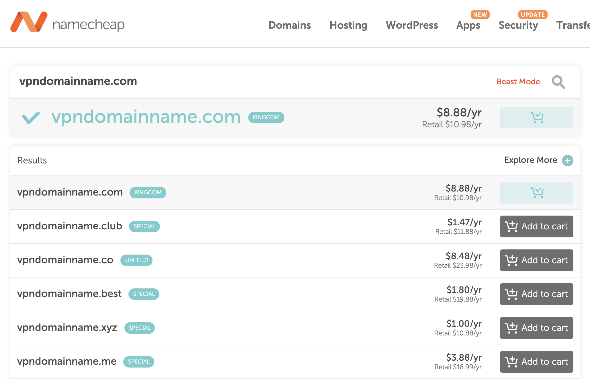

# 1. 攞個網址

[下一頁](./2.md)

你可以係[NameCheap](https://www.namecheap.com)買到，每年US$12.98。你可以揀另外啲嘢，不過我簡單啲就用NameCheap做個例子。

個名係乜唔緊要。揀個平平地就得。

> **要個網址黎做乜**
>
> 其實一早就知某政權會𥄫住VPN流量想整冧佢。佢哋會封殺VPN嘅server。有個網址就可以用CloudFlare去遮住你server個IP。

[2. 用CloudFlare](./2.md)