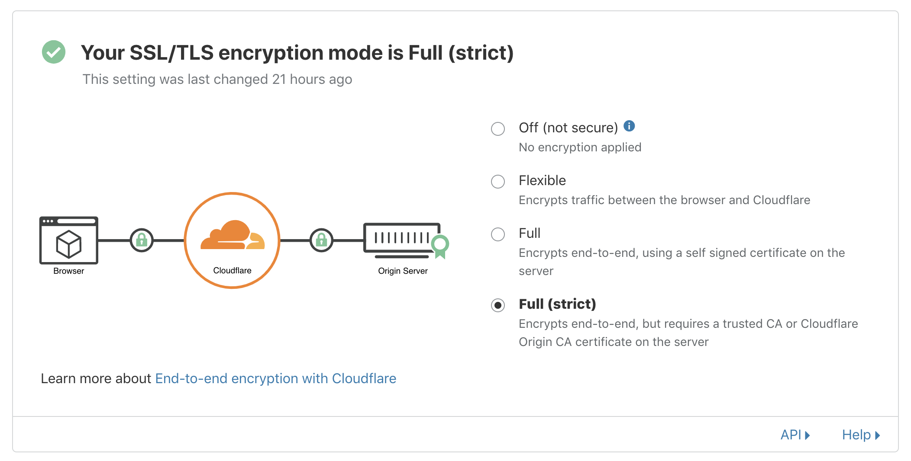

# 2. 用CloudFlare

[上一頁](./1.md) | [下一頁](./3.md)

攞左網址之後去[CloudFlare](https://cloudflare.com)起個網站。

揀免費個plan.

你要將兩個nameserver抄去你註冊網址嗰度先用得CloudFlare。跟你註冊網址嗰邊嘅指示做，通常佢係DNS設定嗰度。

SSL mode要揀"Full (strict)".

> **點解用CloudFlare?**
>
> CloudFlare就係嗰間幫人擋DDOS果個。佢哋有個網絡遮住你個server去擋住啲攻擊。用佢地嘢嘅可以令到個server冇咁易比人攻到或封殺到。

[3. 租個server](./3.md)