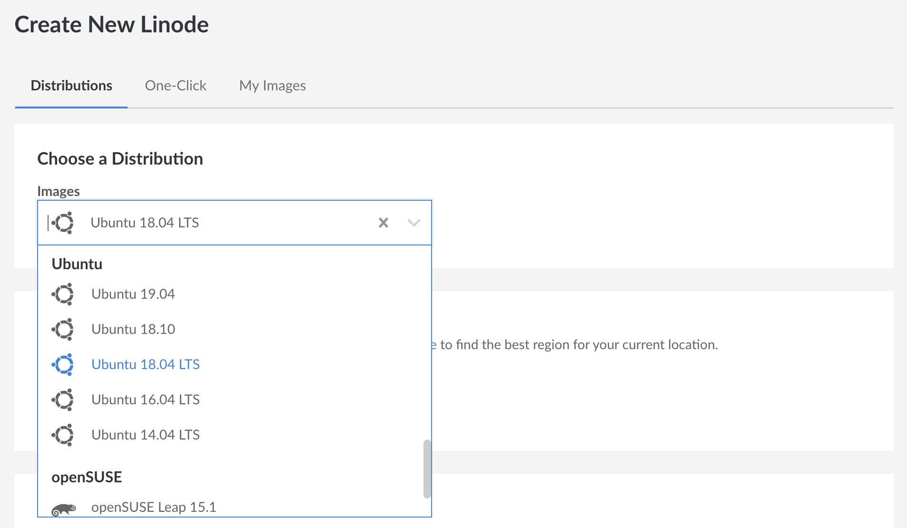
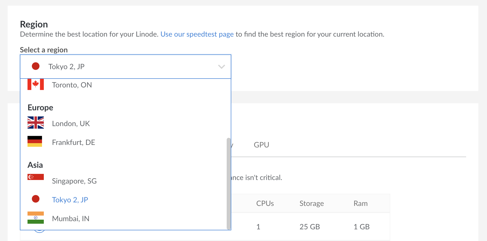
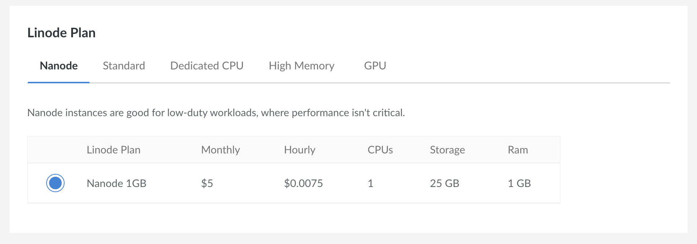
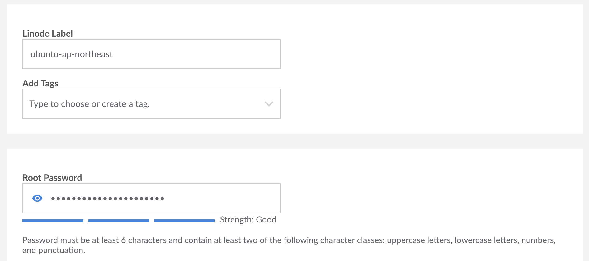
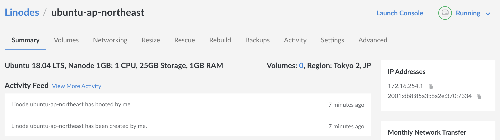
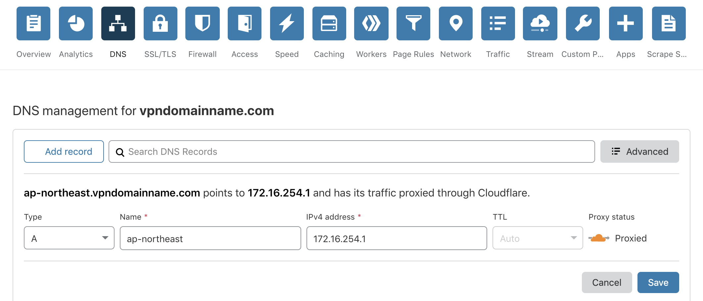

# 3. 租個server

[上一頁](./2.md) | [下一頁](./4.md)

你要起個外國server黎避過審查。你可以係[Amazon Web Services](https://aws.amazon.com/ec2/)、[DigitalOcean](https://www.digitalocean.com/)、[Linode](https://www.linode.com/)同其他公司租個虛擬server (VPS)。我地係呢份嘢會用Linode黎做。

> **虛擬server係乜黎?**
>
> 唔同租成個server，你可以好平就租個虛擬server同其他人分CPU同RAM用，不過你啲資料係完全分開。你可以當佢係一部擺係出面嘅電腦。

首先開個新server。

揀個OS。要揀最新版有長期support嘅Ubuntu。係呢度，我地揀"Ubuntu 18.04 LTS"。

揀個server位置。佢距離你越遠，延誤越大。地區限制會令到某啲嘢只可以係某個國家睇到。要擺係日本就揀"Tokyo 2, JP"。

揀要幾勁嘅server。越勁就越貴。我地用住最細每月US$5嗰個先。你可以遲啲升級佢。

俾個名你server(Linode Label)然後打個root密碼。你要用個密碼黎入去個server。其他嘢由佢，撳"Create".

俾啲時間你server boot機。依家我地係CloudFlare將個網址連去個server。

你server個IP係右邊。抄佢過去CloudFlare度。

係CloudFlare"DNS"嗰頁加下面呢個記錄。

**Type**  
揀"A"。

**Name**  
呢個係subdomain。你想叫佢做乜都得，不過用server位置做個名就容易啲認，尤其係你之後有幾個server嘅話。如果你server叫"ubuntu-ap-northeast"，就用"ap-northeast"。

**IPv4 address**  
呢個係你server個IP。貼係度。

**TTL**  
由佢係"Auto".

**Proxy status**  
由佢舊橙色雲著住。要係"Proxied"。

[4. 裝VPN](./4.md)