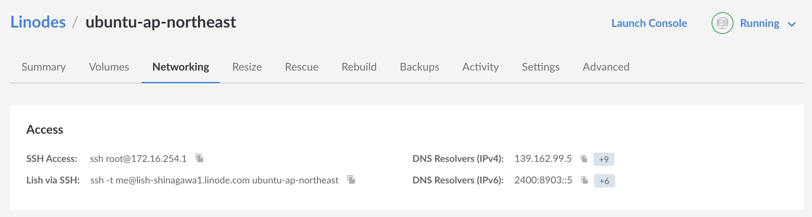
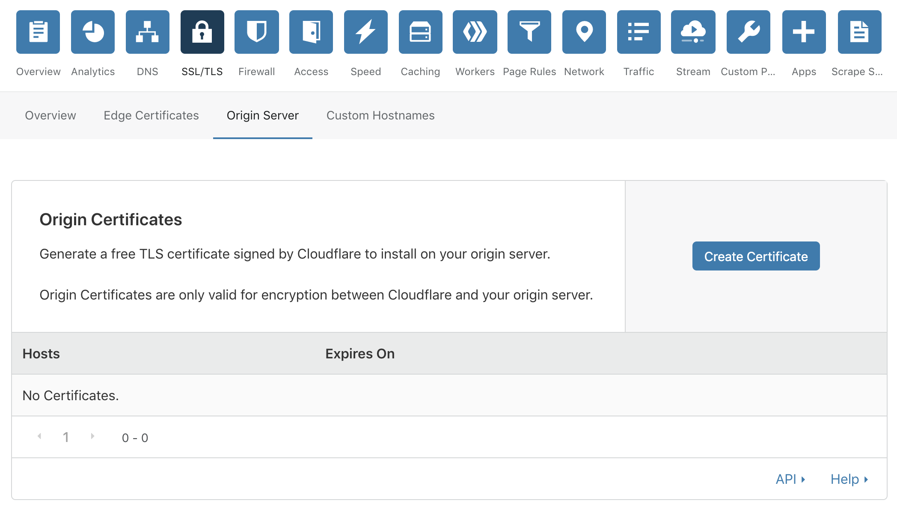
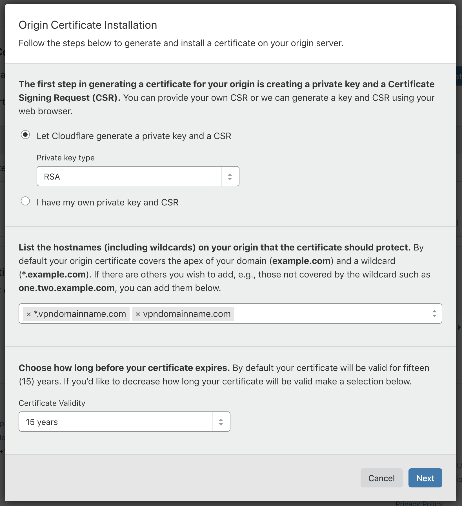
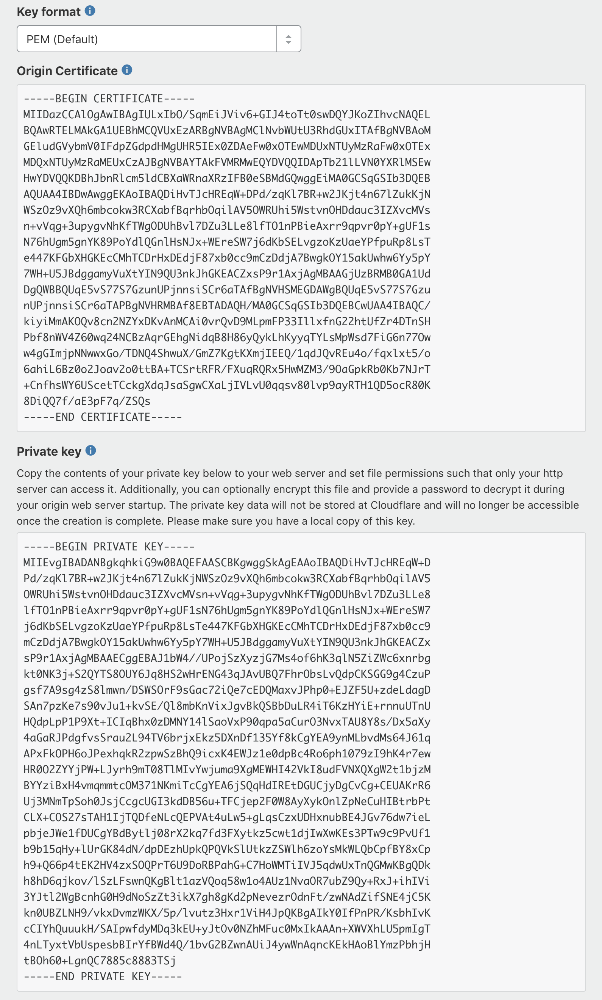

# 4. 裝VPN

[上一頁](./3.md) | [下一頁](./5.md)

你server應該boot左機。入去Linode裡面"Network"嗰頁又或者係你間VPS公司相同嘅地方，睇下點入你個server。



呢度見到

```
ssh root@172.16.254.1
```

我地依家打command入去你server。係Windows用PowerShell，macOS就用Terminal，打上面句command（換左做你server嘅IP）。

> 如果你見到呢樣嘢：
>
> The authenticity of host can't be established. Are you sure you want to continue connecting (yes/no)?
>
> 就打yes。

### 裝nginx

[nginx](https://nginx.org/en/)係個proxy server。我地用佢黎同server聯絡。

```
sudo apt update
sudo apt install nginx
```

### 整nginx

我地要係server起個網站，當你入去嗰陣就比VPN你。

仲記得之前個網址，同埋係CloudFlare度嘅subdomain？依家整個設定file叫做`subdomain.example.com`（用你真嗰個subdomain同網址，例如`ap-northeast.vpndomainname.com`）。我地要擺佢係設定folder`/etc/nginx/sites-available/`嗰度。

```
sudo nano /etc/nginx/sites-available/subdomain.example.com
```

依家你會開左個text editor。係下面個file將每個`subdomain.example.com`換做你嘅subdomain同網址，同將每個`example.com`換做你嘅網址，然後貼係editor度。

```
server {
    server_name          subdomain.example.com;
    listen               *:80;
    listen               [::]:80;

    return 301 https://subdomain.example.com$request_uri;
}

server {
    listen 443 ssl;
    listen [::]:443 ssl;
    ssl on;
    ssl_certificate       /etc/nginx/ssl/example.com.origin.crt;
    ssl_certificate_key   /etc/nginx/ssl/example.com.origin.key;
    ssl_protocols         TLSv1 TLSv1.1 TLSv1.2;
    ssl_ciphers           HIGH:!aNULL:!MD5;
    server_name           subdomain.example.com;
    location / {
        return 418;
    }
    location /ws/ {
        proxy_redirect off;
        proxy_pass http://127.0.0.1:10086;
        proxy_http_version 1.1;
        proxy_set_header Upgrade $http_upgrade;
        proxy_set_header Connection "upgrade";
        proxy_set_header Host $http_host;
        proxy_set_header X-Real-IP $remote_addr;
        proxy_set_header X-Forwarded-For $proxy_add_x_forwarded_for;
    }
}
```

撳ctrl+X去閂左個editor。當佢問"Save modified buffer?"就撳Y。佢問你個file名係乜，你就撳Enter。

要著左個網站，就要link佢入`/etc/nginx/sites-enabled/`個folder。

```
sudo ln -s /etc/nginx/sites-available/subdomain.example.com /etc/nginx/sites-enabled/
```

### 裝SSL Cert

我地要係CloudFlare度整張cert黎加密你server同CloudFlare之間嘅嘢。



入去CloudFlare裡面"SSL/TLS"嗰頁下面嘅"Origin Server"度，撳"Create Certificate"去整張新SSL cert。



呢度乜都唔洗改，就咁撳"Next"。



依家會見到"Origin Certificate"同"Private key"。你要抄晒佢地過去你server。

首先係server開個folder叫`/etc/nginx/ssl/`。

```
sudo mkdir /etc/nginx/ssl
```

將"Origin Certificate"存做`example.com.origin.crt`（換番做你個網址）。

```
sudo nano /etc/nginx/ssl/example.com.origin.crt
```

將"Origin Certificate"入面所有嘢抄左貼去個editor度，然後撳ctrl+X好似上次咁閂左佢。

依家將"Private key"存做`example.com.origin.key`（換番做你個網址）。

```
sudo nano /etc/nginx/ssl/example.com.origin.key
```

將"Private key"入面所有嘢抄左貼去個editor度，然後照舊撳ctrl+X閂左佢。

### 重開nginx

重新開番proxy server後，你個網站就用得。

```
sudo service nginx restart
```

### 裝V2Ray

[V2Ray](https://www.v2ray.com/en/)係個VPN。我地用佢黎翻牆。

```
curl -Ls https://install.direct/go.sh | sudo bash
```

### 整V2Ray

我地要V2Ray係你入去個網站嗰陣比VPN你。

首先鏟左個預設嘅file。

```
sudo rm /etc/v2ray/config.json
```

依家開text editor。

```
sudo nano /etc/v2ray/config.json
```

要連去VPN，你要一個UUID做密碼。你可以[自己整番個](https://www.uuidgenerator.net)。將下面嘅file個UUID`32645a56-d8c5-455d-bf5d-739a6feba131`換做你嗰個，然後抄左貼去個editor度。

```json
{
  "inbounds": [
    {
      "port": 10086,
      "listen": "127.0.0.1",
      "protocol": "vmess",
      "settings": {
        "clients": [
          {
            "id": "32645a56-d8c5-455d-bf5d-739a6feba131",
            "alterId": 64
          }
        ]
      },
      "streamSettings": {
        "network": "ws",
        "wsSettings": {
          "path": "/ws/"
        }
      }
    }
  ],
  "outbounds": [
    {
      "protocol": "freedom",
      "settings": {}
    },
    {
      "protocol": "blackhole",
      "settings": {},
      "tag": "blocked"
    }
  ],
  "routing": {
    "rules": [
      {
        "type": "field",
        "ip": [
          "geoip:private"
        ],
        "outboundTag": "blocked"
      }
    ]
  }
}
```

### 重開V2Ray

重新開番V2Ray，你個VPN server就用得。

```
sudo service v2ray restart
```

[5. 連去你個VPN](./5.md)