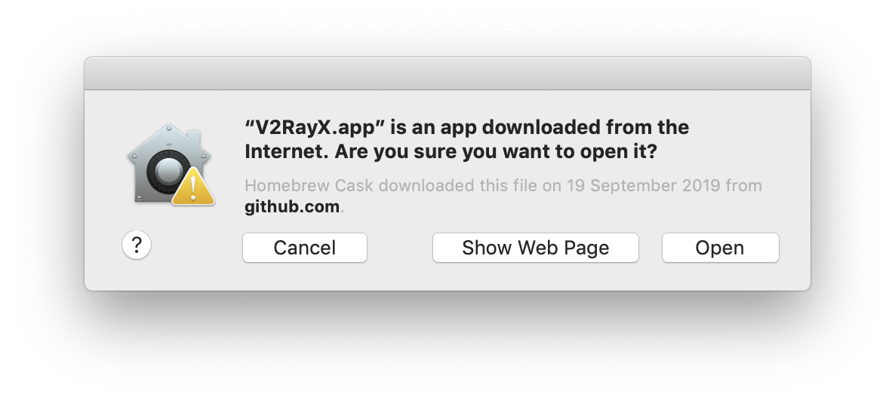

# 5. 連去你個VPN

[上一頁](./4.md)

你個VPN用得啦。呢度俾幾個例子教你點用個VPN。

- [Windows](#windows)
- [macOS](#macos)
- [iOS](#ios)
- [Android](#android)

仲有[其他嘢](https://www.v2ray.com/en/awesome/tools.html)都用得。

### Windows

去[V2RayW](https://github.com/Cenmrev/V2RayW/releases)度download V2RayW.zip。


解壓之後行V2RayW.exe。

<p align="center">
  
</p>

第一次行會彈舊嘢出黎。撳"Yes"。

依家係條bar度right click V2RayW個icon，開個menu撳"Configure..."。

<p align="center">
  
</p>

撳"Add"加個server，跟住下面咁填（將"Address"同"Tag"換左做你個subdomain同網址，係"User ID"度填你個UUID）：

<p align="center">
  
</p>

撳"Transport settings..."，入去"WebSocket"嗰頁打`/ws/`.

<p align="center">
  
</p>

去"TLS"嗰頁剔"Use TLS"。係"Server name"度填你個subdomain同網址。

<p align="center">
  
</p>

存晒啲嘢，反去個menu揀"Global Mode"，再撳"Load Core"，VPN就開左啦。睇下自己個IP係咪轉左。

### macOS

裝[V2RayX](https://github.com/Cenmrev/V2RayX)。如果你個Terminal仲係server度，撳ctrl+D出番黎。

裝左[Homebrew](https://brew.sh/)先。呢個可以幫你係macOS度裝好多嘢。俾啲時間佢裝。

```
/usr/bin/ruby -e "$(curl -fsSL https://raw.githubusercontent.com/Homebrew/install/master/install)"
```

裝V2RayX。

```
brew cask install v2rayx
```

行V2RayX.app。舊嘢彈出黎就撳"Open"。

<p align="center">
  
</p>

第一次行會彈多舊嘢出黎。撳"Install"。

<p align="center">
  
</p>

係上面條bar度撳V2RayX個icon，開個menu撳"Configure..."。

<p align="center">
  
</p>

撳"+"去加個server，跟住下面咁填（將"Address"同"Tag"換左做你個subdomain同網址，係"User ID"度填你個UUID）：

<p align="center">
  
</p>

撳"transport settings..."，去"WebSocket"嗰頁度打`/ws/`。

<p align="center">
  
</p>

去"TLS"嗰頁度剔"Use TLS"。係"TLS serverName"度填你個subdomain同網址。

<p align="center">
  
</p>

存晒啲嘢，反去個menu揀"Global Mode"，再撳"Load Core"，VPN就開左啦。睇下自己個IP係咪轉左。

如果想下次boot機識自己開番，去"System Preferences" > "Users & Groups" > "Login Items"度加V2RayX入去。

<p align="center">
  
</p>

### iOS

裝[Shadowrocket](https://apps.apple.com/us/app/shadowrocket/id932747118)（US$2.99）。

<p align="center">
  
</p>

撳"Add Server"，跟住下面咁填（將"Host"換左做你個subdomain同網址，係"UUID"度填你個UUID）：

<p align="center">
  
</p>

係"Obfuscation"度，將個"Name"轉做websocket，係"Path"度填`/ws/`。

<p align="center">
  
</p>

存好啲嘢就撳"Not Connected"隔離嗰粒掣。有舊嘢會彈出黎，撳"Allow"然後打你部機個密碼去加個VPN設定。

<p align="center">
  
</p>

你用緊VPN啦。睇下自己個IP係咪轉左。

### Android

裝[BifrostV](https://play.google.com/store/apps/details?id=com.github.dawndiy.bifrostv)。

<p align="center">
  
</p>

係上面條bar度撳"Add"個icon，揀"Manual Settings"，跟住下面咁填（將 "Profile Name"、"Host"同"TLS Server Name"換左做你個subdomain同網址，係"UserId"度填你個UUID）：

<p align="center">
  
</p>

存好啲嘢，撳一下個profile，再撳右下角粒掣。你要批准佢行。

<p align="center">
  
</p>

你用緊VPN啦。睇下自己個IP係咪轉左。